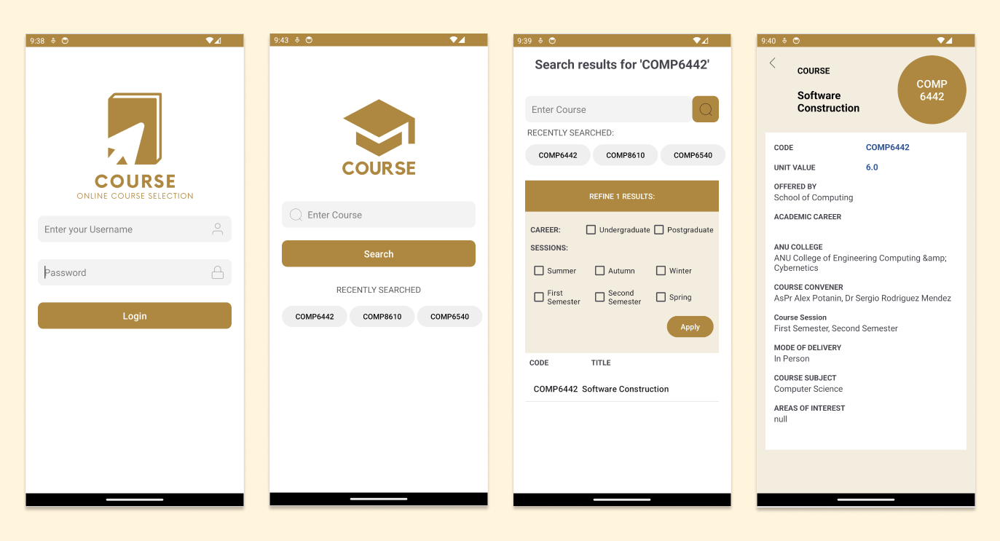
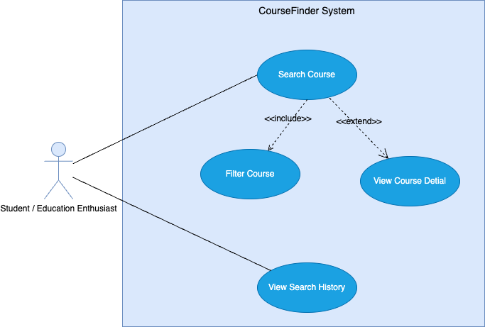
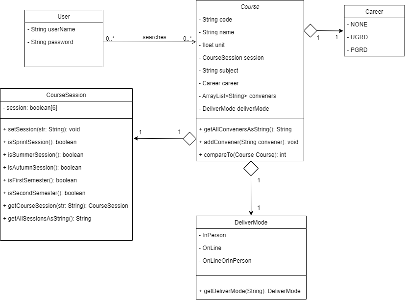

# 📘 CourseFinder  

**CourseFinder** is an Android application designed for students and education enthusiasts to easily search, filter, and explore university courses. With powerful search algorithms and user-friendly filters, CourseFinder helps students quickly find the most suitable courses for their study plans.  

  

---

## ✨ Features  

### 🔑 User Authentication  
- Secure login with **Firebase Authentication**.  
- User credentials are verified before accessing the app.  
- Once logged in, course data is automatically loaded.  

---

### 📚 Course Search  
- Multi-condition search supported:  
  - By **course code**, **subject**, or **course name**.  
- Flexible query format:  
  - `COMP` → Returns all courses with COMP prefix.  
  - `Machine Learning` → Returns courses with related names.  
  - `code=2100 | subject=Computer Science` → Combines multiple conditions.  
- Supports fuzzy matching and relevance-based ranking.  

---

### 🎯 Search Filters  
- Refine search results with dynamic filters:  
  - **Career**: Undergraduate / Postgraduate.  
  - **Session**: Summer, First Semester, Second Semester.  
- Real-time updates on results when filters are applied.  

  

---

### 📖 Course Details  
- View full information about each course:  
  - Code, name, description, career, sessions.  
- Compare multiple courses to make informed choices.  

---

### 🕒 Search History  
- Automatically records search history in a local **JSON file**.  
- Recent queries are displayed on the homepage.  
- Users can quickly re-select previous queries with a single tap.  

---

### 📊 Data Management  
- Supports multiple data formats:  
  - **XML** for course data.  
  - **JSON** for search history.  
- Integrates with **Firebase Realtime Database** for updates.  

---

### 🔍 Algorithm Support  
- **AVL Tree**: Efficient exact lookup by course code.  
- **B+ Tree**: Fast retrieval of multiple courses under the same subject.  
- **TF-IDF fuzzy search**: Improves relevance of name-based search results.  

  

---

## 👩‍🎓 Example Use Cases  

1. **Finding elective courses**  
   - A student types `COMP` in the search bar.  
   - The app shows all computing-related courses.  
   - They select "Advanced Algorithms" to read more details.  

2. **Filtering by session**  
   - A student searches for computing electives.  
   - They click "Refine Results" and select **Summer** + **First Semester**.  
   - The list updates to show only courses available in those terms.  

3. **Reusing search history**  
   - The app displays recent queries under the search box.  
   - The student clicks on a past query → it auto-fills the search bar.  

---

## 🚀 Implemented Features  
- ✅ Firebase login & authentication  
- ✅ Multi-condition course search  
- ✅ Real-time filtering and sorting  
- ✅ Search history with JSON storage  
- ✅ XML + JSON + Firebase data integration  
- ✅ Course details view & fuzzy matching  

---

## 🐞 Known Issues  
- Missing toast message when no search results are found.  
- Misalignment issue when course names are too long in the list.  
- Dataset does not include some course prefixes (e.g., `EXTN`).  
- History updates only after re-login.  

---

## 📦 Installation  
Download and install the APK:  
[➡️ Download APK](items/release-v1.0.0.apk)  

---

## 📹 Demo Video  
[🎥 Watch Demo](items/features.mp4)  

---
