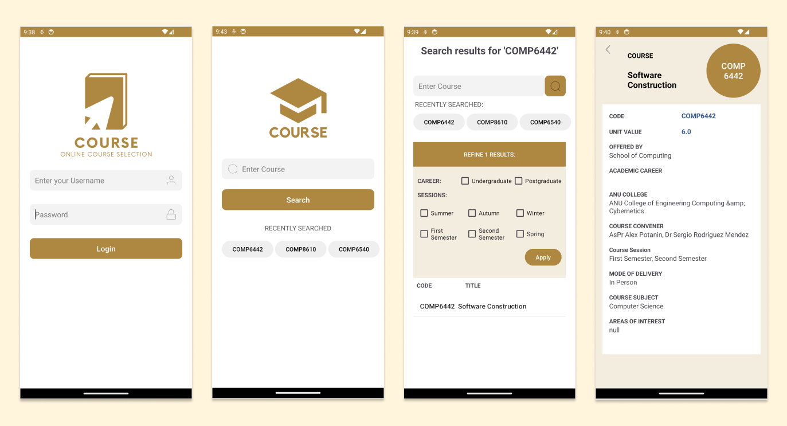
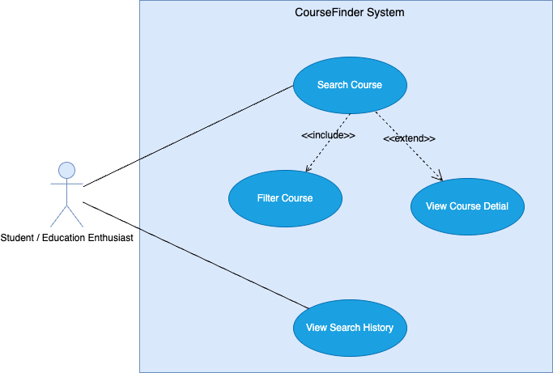
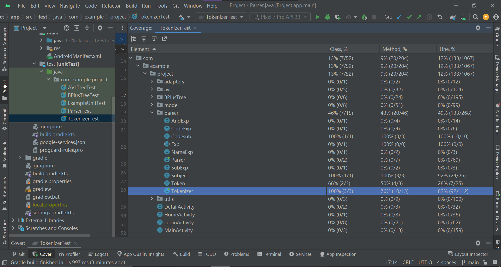
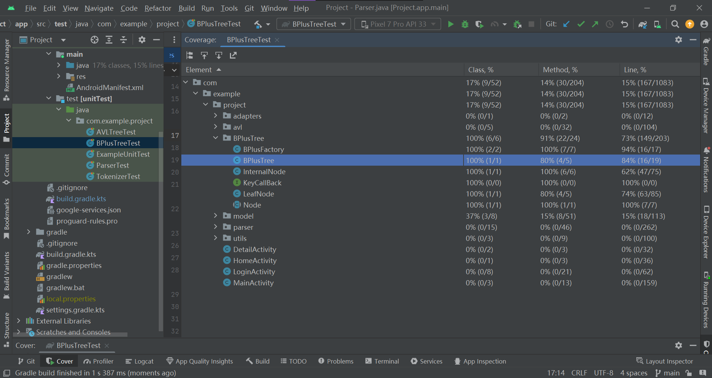
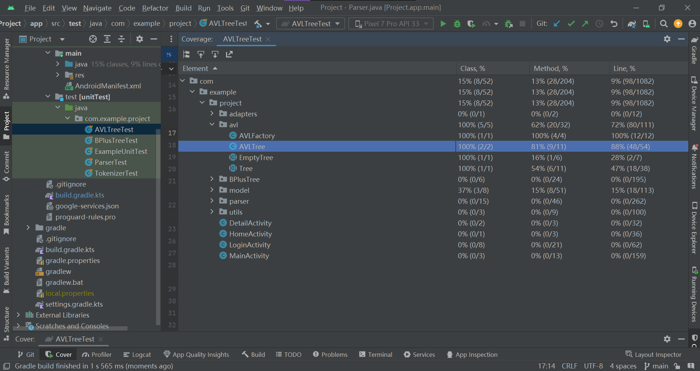
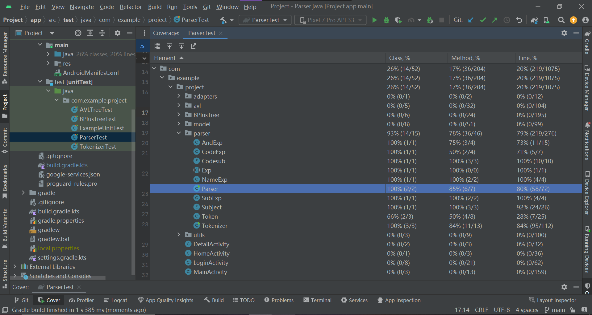

# [G28 - New Bee] Report

## Table of Contents

1. [Administrative](#administrative)
2. [Team Members and Roles](#team-members-and-roles)
3. [Summary of Individual Contributions](#summary-of-individual-contributions)
4. [Application Description](#application-description)
5. [Application Use Cases and or Examples](#application-use-cases-and-or-examples)
6. [Application UML](#application-uml)
7. [Code Design and Decisions](#code-design-and-decisions)
8. [Implemented Features](#implemented-features)
9. [Summary of Known Errors and Bugs](#summary-of-known-errors-and-bugs)
10. [Testing Summary](#testing-summary)
11. [Team Management](#team-management)
12. [Conflict Resolution Protocol](#conflict-resolution-protocol)
13. [Video](#video)
14. [Standalone APK](#standalone-apk)

## Administrative
- Firebase Repository Link: https://project-31d5b-default-rtdb.firebaseio.com/
   - Confirm: I have already added comp21006442@gmail.com as a Developer to the Firebase project prior to due date.
- Two user accounts for markers' access are usable on the app's APK (do not change the username and password unless there are exceptional circumstances. Note that they are not real e-mail addresses in use):
   - Username: comp2100@anu.edu.au	Password: comp2100
   	 Username: comp6442@anu.edu.au	Password: comp6442

## Team Members and Roles
The key area(s) of responsibilities for each member

| UID      |    Name     |        Role         |
| :------- | :---------: | :-----------------: |
| U7580335 | Shiying Cai |   Product Manager   |
| U7619947 | Xinlong Wu  | Technical Architect |
| U7726399 | Meitong Liu |  Backend Developer  |
| U6393399 |  Xuan Liu   | Frontend Developer  |

## Summary of Individual Contributions

1. **u7580335, Shiying Cai**  I have 25% contribution, as follows:  
  - **Code Contribution in the final App**
    - Feature LogIn, LoadShowData, Search, Search-Filter, UI-Layout, Data-Formats, FB-Auth - class LoginActivity: [LoginActivity](https://gitlab.cecs.anu.edu.au/u7580335/ga-23s2/-/blob/main/Project/app/src/main/java/com/example/project/LoginActivity.java), class HomeActivity: [HomeActivity](https://gitlab.cecs.anu.edu.au/u7580335/ga-23s2/-/blob/main/Project/app/src/main/java/com/example/project/HomeActivity.java), class MainActivity: [MainActivity](https://gitlab.cecs.anu.edu.au/u7580335/ga-23s2/-/blob/main/Project/app/src/main/java/com/example/project/MainActivity.java), class DetailActivity: [DetailActivity](https://gitlab.cecs.anu.edu.au/u7580335/ga-23s2/-/blob/main/Project/app/src/main/java/com/example/project/DetailActivity.java)
    
    - UI files: [activity_login.xml](https://gitlab.cecs.anu.edu.au/u7580335/ga-23s2/-/blob/main/Project/app/src/main/res/layout/activity_login.xml), [activity_home.xml](https://gitlab.cecs.anu.edu.au/u7580335/ga-23s2/-/blob/main/Project/app/src/main/res/layout/activity_home.xml), [activity_main.xml](https://gitlab.cecs.anu.edu.au/u7580335/ga-23s2/-/blob/main/Project/app/src/main/res/layout/activity_main.xml), [activity_detail.xml](https://gitlab.cecs.anu.edu.au/u7580335/ga-23s2/-/blob/main/Project/app/src/main/res/layout/activity_detail.xml), [User class](https://gitlab.cecs.anu.edu.au/u7580335/ga-23s2/-/blob/main/Project/app/src/main/java/com/example/project/model/User.java)
    
       
    
  - **Code and App Design** 
    - Through discussions with team members, it was decided together to use AVL trees and B+ trees
    - Since the app was inspired by ANU's Programs and Courses website, it was decided to use a uniform yellow color with ANU when designing the app's UI. In the early stages of design, I used Figma to style each page. 
      
2. **u6393399, Xuan Liu**  I have 25% contribution, as follows:  
  - **Code Contribution in the final App**
    - Feature Search, LoadShowData, UI-Layout, Data-Formats - class HomeActivity:  [HomeActivity.java](https://gitlab.cecs.anu.edu.au/u7580335/ga-23s2/-/blob/main/Project/app/src/main/java/com/example/project/HomeActivity.java), class MainActivity: [MainActivity.java](https://gitlab.cecs.anu.edu.au/u7580335/ga-23s2/-/blob/main/Project/app/src/main/java/com/example/project/MainActivity.java), class DetailActivity:  [Detail Activity.java](https://gitlab.cecs.anu.edu.au/u7580335/ga-23s2/-/blob/main/Project/app/src/main/java/com/example/project/DetailActivity.java), class CourseAdapter: [CourseAdapter.java](https://gitlab.cecs.anu.edu.au/u7580335/ga-23s2/-/blob/main/Project/app/src/main/java/com/example/project/adapters/CourseAdapter.java),  class HistoryManager: [HistoryManager.java](https://gitlab.cecs.anu.edu.au/u7580335/ga-23s2/-/blob/main/Project/app/src/main/java/com/example/project/utils/HistoryManager.java)
    
    - [CourseSession class](https://gitlab.cecs.anu.edu.au/u7580335/ga-23s2/-/blob/main/Project/app/src/main/java/com/example/project/model/CourseSession.java#L79-111): getAllSessionsAsString(),  [activity_main.xml](https://gitlab.cecs.anu.edu.au/u7580335/ga-23s2/-/blob/main/Project/app/src/main/res/layout/activity_main.xml)
    
       
    
  - **Code and App Design** 
    - Contributed to data structure decisions of avl tree and B+ tree through active team discussions
    - Proposed a user-friendly UI design through active team discussions
      
3. **u7726399, Meitong Liu**  I have 25% contribution, as follows:  
  - **Code Contribution in the final App**
	- Feature doSearch in MainActivity - class MainActivity: [doSearch](https://gitlab.cecs.anu.edu.au/u7580335/ga-23s2/-/blob/main/Project/app/src/main/java/com/example/project/MainActivity.java#L282-365) 
    - AVL Tree - class Tree: [Tree](https://gitlab.cecs.anu.edu.au/u7580335/ga-23s2/-/blob/main/Project/app/src/main/java/com/example/project/avl/Tree.java), class EmptyTree: [EmptyTree](https://gitlab.cecs.anu.edu.au/u7580335/ga-23s2/-/blob/main/Project/app/src/main/java/com/example/project/avl/EmptyTree.java), class AVLTree: [AVLTree](https://gitlab.cecs.anu.edu.au/u7580335/ga-23s2/-/blob/main/Project/app/src/main/java/com/example/project/avl/AVLTree.java), class AVLFactory: [AVLFactory](https://gitlab.cecs.anu.edu.au/u7580335/ga-23s2/-/blob/main/Project/app/src/main/java/com/example/project/avl/AVLFactory.java)
    - Tokenizer & Parser - class Tokenizer: [Tokenizer](https://gitlab.cecs.anu.edu.au/u7580335/ga-23s2/-/blob/main/Project/app/src/main/java/com/example/project/parser/Tokenizer.java), class Token: [Token](https://gitlab.cecs.anu.edu.au/u7580335/ga-23s2/-/blob/main/Project/app/src/main/java/com/example/project/parser/Token.java), class Parser: [Parser](https://gitlab.cecs.anu.edu.au/u7580335/ga-23s2/-/blob/main/Project/app/src/main/java/com/example/project/parser/Parser.java)
    - Factory Design Pattern - class Exp: [Exp](https://gitlab.cecs.anu.edu.au/u7580335/ga-23s2/-/blob/main/Project/app/src/main/java/com/example/project/parser/Exp.java), class NameExp: [NameExp](https://gitlab.cecs.anu.edu.au/u7580335/ga-23s2/-/blob/main/Project/app/src/main/java/com/example/project/parser/NameExp.java), class SubExp: [SubExp](https://gitlab.cecs.anu.edu.au/u7580335/ga-23s2/-/blob/main/Project/app/src/main/java/com/example/project/parser/SubExp.java), class CodeExp: [CodeExp](https://gitlab.cecs.anu.edu.au/u7580335/ga-23s2/-/blob/main/Project/app/src/main/java/com/example/project/parser/CodeExp.java), class AndExp: [AndExp](https://gitlab.cecs.anu.edu.au/u7580335/ga-23s2/-/blob/main/Project/app/src/main/java/com/example/project/parser/AndExp.java)
    - Tests for Tokenizer and Parser: - class TokenizerTest:[TokenizerTest](https://gitlab.cecs.anu.edu.au/u7580335/ga-23s2/-/blob/main/Project/app/src/test/java/com/example/project/TokenizerTest.java), class ParserTest: [ParserTest](https://gitlab.cecs.anu.edu.au/u7580335/ga-23s2/-/blob/main/Project/app/src/test/java/com/example/project/ParserTest.java)
    - Code files generated from origin data: - enum class Subject: [Subject](https://gitlab.cecs.anu.edu.au/u7580335/ga-23s2/-/blob/main/Project/app/src/main/java/com/example/project/parser/Subject.java), enum class Codesub: [Codesub](https://gitlab.cecs.anu.edu.au/u7580335/ga-23s2/-/blob/main/Project/app/src/main/java/com/example/project/parser/Codesub.java)
     
  - **Code and App Design** 
	- I proposed the course-searching application idea.
    - The search grammar and production rule was designed by me. 
    - I proposed factory design pattern for parser expression.
    - Contributed to the decesion of multi-structure and details of achieveing AVL data structure.
     
  - **Others**:   
    - I independently created the feature video.
      

4. **u7619947, Xinlong Wu**  I have 25% contribution, as follows:  
  - **Code Contribution in the final App**
    - Feature initCourseData - [LoginActivity.java](https://gitlab.cecs.anu.edu.au/u7580335/ga-23s2/-/blob/main/Project/app/src/main/java/com/example/project/LoginActivity.java)
    - Feature doSearch - [MainActivity.java](https://gitlab.cecs.anu.edu.au/u7580335/ga-23s2/-/blob/main/Project/app/src/main/java/com/example/project/MainActivity.java)
    - Feature doFiltter - [MainActivity.java](https://gitlab.cecs.anu.edu.au/u7580335/ga-23s2/-/blob/main/Project/app/src/main/java/com/example/project/MainActivity.java)
    - Composite Pattern - class Node: [find()](https://gitlab.cecs.anu.edu.au/u7580335/ga-23s2/-/blob/main/Project/app/src/main/java/com/example/project/BPlusTree/Node.java#L22)
    - Singleton Pattern - class AVLFactory: [getCourseAVLTree()](https://gitlab.cecs.anu.edu.au/u7580335/ga-23s2/-/blob/main/Project/app/src/main/java/com/example/project/avl/AVLFactory.java#L27), class BPlusFactory: [getBPlusTree()](https://gitlab.cecs.anu.edu.au/u7580335/ga-23s2/-/blob/main/Project/app/src/main/java/com/example/project/BPlusTree/BPlusFactory.java#L38)
    - Strategy Pattern - class KeyCallBack: [getKey()](https://gitlab.cecs.anu.edu.au/u7580335/ga-23s2/-/blob/main/Project/app/src/main/java/com/example/project/BPlusTree/KeyCallBack.java#L6), class FilterCallBack: [isMatch()](https://gitlab.cecs.anu.edu.au/u7580335/ga-23s2/-/blob/main/Project/app/src/main/java/com/example/project/model/FilterCallBack.java#L10)
    - [Career](https://gitlab.cecs.anu.edu.au/u7580335/ga-23s2/-/blob/main/Project/app/src/main/java/com/example/project/model/Career.java)
    - [Course](https://gitlab.cecs.anu.edu.au/u7580335/ga-23s2/-/blob/main/Project/app/src/main/java/com/example/project/model/Course.java)
    - [CourseSession](https://gitlab.cecs.anu.edu.au/u7580335/ga-23s2/-/blob/main/Project/app/src/main/java/com/example/project/model/CourseSession.java)
    - [DeliverMode](https://gitlab.cecs.anu.edu.au/u7580335/ga-23s2/-/blob/main/Project/app/src/main/java/com/example/project/model/DeliverMode.java)
    - [LeafNode](https://gitlab.cecs.anu.edu.au/u7580335/ga-23s2/-/blob/main/Project/app/src/main/java/com/example/project/BPlusTree/LeafNode.java)
    - [InternalNode](https://gitlab.cecs.anu.edu.au/u7580335/ga-23s2/-/blob/main/Project/app/src/main/java/com/example/project/BPlusTree/InternalNode.java)
     

  - **Code and App Design** 
    - BPlusTree, Composite Pattern, Singleton Pattern, Strategy Pattern
       

  - **Others**: 
    - [DataSpider](https://gitlab.cecs.anu.edu.au/u7580335/ga-23s2/-/tree/main/DataSpider)
      

## Application Description

**CourseFinder** is an online course search application designed specifically for students and education enthusiasts. Through this app, users can easily browse a wide range of courses offered by schools and gain in-depth knowledge about each one. With various filtering options such as course type, career, and sessions, users can effortlessly find the course that best suits their needs and interests. CourseFinder is dedicated to providing every user with the highest quality and most personalized course search experience.

## Application Use Cases and or Examples

*Anna wants to search for computing elective courses*

1. *Anna is a second-year student looking for an interesting computing elective course to fill her schedule.*
2. *She opens the CourseFinder applicationand and logins with her account.*
3. *On the homepage, Anna types in "COMP" and clicks 'Search' button.*
4. *The app presents her with a list of courses.*
5. *Anna clicks on "Advanced Algorithms"*
6. *After reading the course description. Anna decides to enroll.*

*John wants to filters computing elective courses by sessions*

1. *John opens the CourseFinder app, hoping to find computing elective courses that fit into his available time slots.*
2. *On the homepage, he types in "COMP" and clicks on the 'Search' button.*
3. *The app presents him with a list of courses.*
4. *Noticing a "Refine 127 Results" button on the center, he clicks on it.*
5. *A dropdown filter box appears, listing variou filtering options such as "Career" and "Sessions."*
6. *John selects "Summer" and "First Semester".*
7. *The course list updates, displaying only the course that have summer or first semester seesions.*
8. *He then decides to enroll in one of the courses and continues with the enrollment process.*

***Use cases***

*Targets Users: College Students*

* *Users can search for computing elective courses to fill their schedules.*
* *Users can view detailed descriptions of each course.*
* *Students can filter courses based on sessions to find courses with specific start times*
* *Users can compare multiple courses to determine which one fits their need the best.*
* *Education enthusiasts can learn about all the programs offered by the school*

**Use Case Diagrams**

 

## Application UML

  

## Code Design and Decisions

### Data Structures

*we have used the following data structures in my project:*

1. *AVL TREE*
   * *Objective: used for course Info objects sorted by entire course code as the key.*
   * *Code Locations: defined in [Class AVLTree](https://gitlab.cecs.anu.edu.au/u7580335/ga-23s2/-/blob/main/Project/app/src/main/java/com/example/project/avl/AVLTree.java; Using at [initCourseData](https://gitlab.cecs.anu.edu.au/u7580335/ga-23s2/-/blob/main/Project/app/src/main/java/com/example/project/LoginActivity.java#L134) and [doSearch](https://gitlab.cecs.anu.edu.au/u7580335/ga-23s2/-/blob/main/Project/app/src/main/java/com/example/project/MainActivity.java#L264)*
   * *Reasons:*
      * We want that only one matched course will be searched by a exactly course code.
      * AVL tree has a best search efficiency and it only return one item if it is exist.

2. *B+ TREE*
   * *Objective: used for course Info objects sorted by part of course code, subject as the key.*
   * *Code Locations: defined in [Class BPlusTree](https://gitlab.cecs.anu.edu.au/u7580335/ga-23s2/-/blob/main/Project/app/src/main/java/com/example/project/BPlusTree/BPlusTree.java; Using at [initCourseData](https://gitlab.cecs.anu.edu.au/u7580335/ga-23s2/-/blob/main/Project/app/src/main/java/com/example/project/LoginActivity.java#L134) and [doSearch](https://gitlab.cecs.anu.edu.au/u7580335/ga-23s2/-/blob/main/Project/app/src/main/java/com/example/project/MainActivity.java#L264)*
   * *Reasons:*
      * There are many course has same Course subject code, Course number code and Subject, It should return a list that all matched courses
      * The internal node of B+ tree only store the index of the item, only leaf node store the item object, and the leaf node of B+ tree is a kind of linked list, it will be better in this case since we need a course list

### Design Patterns

1. *Composite Pattern*
   * *Objective: Used for LeafNode and InternalNode of B+ tree. So that They have same function*
   * *Code Locations: defined in [Class Node](https://gitlab.cecs.anu.edu.au/u7580335/ga-23s2/-/blob/main/Project/app/src/main/java/com/example/project/BPlusTree/Node.java); processed using at [Class InternalNode](https://gitlab.cecs.anu.edu.au/u7580335/ga-23s2/-/blob/main/Project/app/src/main/java/com/example/project/BPlusTree/LeafNode.java) and [Class LeafNode](https://gitlab.cecs.anu.edu.au/u7580335/ga-23s2/-/blob/main/Project/app/src/main/java/com/example/project/BPlusTree/LeafNode.java)*
   * *Reasons:*
      * There are two types of nodes normally used in a b+ tree, which are the internal nodes and the leaf nodes, and they all have the same methods, the only difference is that the methods are implemented differently. So I'll abstract the same methods into a new interface class Node, in which leaf nodes and internal nodes share a common interface.

2. *Singleton Pattern*
   * *Objective: Used for AVLTree and B+ tree. So that we don't need create tree before each use.*
   * *Code Locations: defined in [Class AVLFactory](https://gitlab.cecs.anu.edu.au/u7580335/ga-23s2/-/blob/main/Project/app/src/main/java/com/example/project/avl/AVLFactory.java) and [Class BPlusFactory](https://gitlab.cecs.anu.edu.au/u7580335/ga-23s2/-/blob/main/Project/app/src/main/java/com/example/project/BPlusTree/LeafNode.java); processed using at [Method initCourseData](https://gitlab.cecs.anu.edu.au/u7580335/ga-23s2/-/blob/main/Project/app/src/main/java/com/example/project/LoginActivity.java#L134) and [Method doSearch](https://gitlab.cecs.anu.edu.au/u7580335/ga-23s2/-/blob/main/Project/app/src/main/java/com/example/project/MainActivity.java#L264)*
   * *Reasons:*
      * The data for the course information will always remain the same, meaning that the data only needs to be loaded once during the execution. Therefore, using the singleton pattern maximizes data reuse and avoids wasting resources.

3. *Strategy Pattern*
   * *Objective: Used for build tree with different key, filtter data by different strategy*
   * *Code Locations: defined in [Class KeyCallBack](https://gitlab.cecs.anu.edu.au/u7580335/ga-23s2/-/blob/main/Project/app/src/main/java/com/example/project/BPlusTree/KeyCallBack.java) and [Class FilterCallBack](https://gitlab.cecs.anu.edu.au/u7580335/ga-23s2/-/blob/main/Project/app/src/main/java/com/example/project/model/FilterCallBack.java); processed using at [Method initCourseData](https://gitlab.cecs.anu.edu.au/u7580335/ga-23s2/-/blob/main/Project/app/src/main/java/com/example/project/LoginActivity.java#L134) and [Method doFilterBy](https://gitlab.cecs.anu.edu.au/u7580335/ga-23s2/-/blob/main/Project/app/src/main/java/com/example/project/MainActivity.java#L252)*
   * *Reasons:*
      * We use different Key in different B+ tree, We can just pass the GetKey strategy to build the tree by different key. 
      * Set different filtter strategy

4. *Factory Pattern*
   * *Objective: Used for create AVLTree and B+ tree*
   * *Code Locations: defined in [Class AVLFactory](https://gitlab.cecs.anu.edu.au/u7580335/ga-23s2/-/blob/main/Project/app/src/main/java/com/example/project/avl/AVLFactory.java) and [Class BPlusFactory](https://gitlab.cecs.anu.edu.au/u7580335/ga-23s2/-/blob/main/Project/app/src/main/java/com/example/project/BPlusTree/LeafNode.java); processed using at [Method initCourseData](https://gitlab.cecs.anu.edu.au/u7580335/ga-23s2/-/blob/main/Project/app/src/main/java/com/example/project/LoginActivity.java#L134) and [Method doSearch](https://gitlab.cecs.anu.edu.au/u7580335/ga-23s2/-/blob/main/Project/app/src/main/java/com/example/project/MainActivity.java#L264)*
   * *Reasons:*
      * We can ignore complex create logic in Android Activity

### Parser

### <u>Grammar(s)</u>

Our app can perform searches based on course codes, subjects, and names, with '|' as a delimiter between each search parameter. The search queries are case-insensitive.  

#### Simplified Grammar ####

The priority of the three mentioned search criteria is decreasing by order( code > subject > name).Our algorithm will automatically identify which search criterion corresponds to each input, and display all search results for the parameter with highest priority, which has been sorted basing on the relevance to the rest of the search parameter.   

- Course code search: Support prefix search, suffix search, and full-name search.(eg. "COMP","2100","COMP6442")
- Subject search: Supports the inclusion of spaces, numbers, and other non-alphabet characters, but the alphabetic portion must be an exact match.(eg. "Computer Science", "Environmental Management&Development")
- Name search: If the system can find a course name that matches the search query exactly, it will display that course; otherwise, it will perform a TF-IDF-driven fuzzy search.(To see more details, go to [Surprised Features](###Surprised Features) part in this report.)(eg."Software Construction", "Machine Learning")  

When a query statement contains multiple elements related to the same search criterion, our app will consider the first occurrence. For example, with query "COMP|BUSI7055", the app will only show all courses with code "COMPxxxx", where "xxxx" represents arbintary 4-digit number.   

#### Unsimplified Grammar ####

The complete syntax used internally within the program is as shown in the following text, and users can combine both syntax forms.  

The parser component of the project is responsible for processing input strings following a specific syntax pattern. The accepted input format is defined as：   

**"name=xxx|subject=xxx|code=xxx"**

,where '|' character is used to separate each equation.   

- In each equation, the equals sign and its left-hand content can be ignored since the program will automatically recognize the token type and add the default prefix in function [normalizeText](https://gitlab.cecs.anu.edu.au/u7580335/ga-23s2/-/blob/main/Project/app/src/main/java/com/example/project/parser/Tokenizer.java#L184).   
- The letters inputed by users can be either uppercase or lowercase.  
- The order of the equations is arbitrary.  
- What's more, in [next()](https://gitlab.cecs.anu.edu.au/u7580335/ga-23s2/-/blob/main/Project/app/src/main/java/com/example/project/parser/Tokenizer.java#L84), the program will trim the spaces around tokens.   

There are some advantages of this parser design: 

1. The algorithm has excellent robustness. Not only because it can partially ignore irrelevant content such as spaces and punctuation but also the parser handles exceptions for illegal productions, providing clear error messages when faced with unexpected input. 
2. Our code is designed to allow for easy extension and modification. For example, developers can simply expand the grammar to handle additional cases.
3. This syntax supports multi-condition searches, allowing users to search using course codes, course names, and subjects as keywords, catering to different needs. 
4. Last but not least, the preprocess that embodying the human-centered design principle and simplifying the syntax functionality, provides users with an excellent user experience.

### <u>Tokenizers and Parsers</u>

In our analysis of query statements, we employ a tokenizer and a parser. The tokenizer section consists of two classes:[Token](https://gitlab.cecs.anu.edu.au/u7580335/ga-23s2/-/blob/main/Project/app/src/main/java/com/example/project/parser/Token.java)and [Tokeniser](https://gitlab.cecs.anu.edu.au/u7580335/ga-23s2/-/blob/main/Project/app/src/main/java/com/example/project/parser/Tokenizer.java). In terms of parser, except [Parser](https://gitlab.cecs.anu.edu.au/u7580335/ga-23s2/-/blob/main/Project/app/src/main/java/com/example/project/parser/Parser.java) class, the code for parser functionality is  also comprised of an [Exp](https://gitlab.cecs.anu.edu.au/u7580335/ga-23s2/-/blob/main/Project/app/src/main/java/com/example/project/parser/Exp.java) interface and its subclasses([SubExp](https://gitlab.cecs.anu.edu.au/u7580335/ga-23s2/-/blob/main/Project/app/src/main/java/com/example/project/parser/SubExp.java), [CodeExp](https://gitlab.cecs.anu.edu.au/u7580335/ga-23s2/-/blob/main/Project/app/src/main/java/com/example/project/parser/CodeExp.java), [AndExp](https://gitlab.cecs.anu.edu.au/u7580335/ga-23s2/-/blob/main/Project/app/src/main/java/com/example/project/parser/AndExp.java), [NameExp](https://gitlab.cecs.anu.edu.au/u7580335/ga-23s2/-/blob/main/Project/app/src/main/java/com/example/project/parser/NameExp.java)), along with two enum classes,[Subject](https://gitlab.cecs.anu.edu.au/u7580335/ga-23s2/-/blob/main/Project/app/src/main/java/com/example/project/parser/Subject.java) and [CodeSub](https://gitlab.cecs.anu.edu.au/u7580335/ga-23s2/-/blob/main/Project/app/src/main/java/com/example/project/parser/Codesub.java), which are used for assessing input validity.
The parser is extensible, when more conditions are provided, the developers can add more production rules and subclasses of [Exp](https://gitlab.cecs.anu.edu.au/u7580335/ga-23s2/-/blob/main/Project/app/src/main/java/com/example/project/parser/Exp.java) to upgrade the app.

#### Tokeniser ####  
We designed a [Token](https://gitlab.cecs.anu.edu.au/u7580335/ga-23s2/-/blob/main/Project/app/src/main/java/com/example/project/parser/Token.java) class to save extracted token from tokenizer. Each token has its surface form saved in [@code token], and type saved in {@code type} which is one of the predefined type in Type enum. 
The following are the different types of tokens:  

| Type   |Discription  |example
|:---------|---|---------:|
| SEP| a vertical bar for sepration| " &#124; "|
| CODE| a specific String "code="|"code="|
 | CODESUB|String of four upper letters that belongs to enum class.   |"COMP"|
 | CODENUM|a string of four numbers.|"6442"|
 | NAME|a specific String "name="|"name="|
 | SUBJECT|a specific String"subject="|"subject="|
 | SUBVALUE|String that belongs to enum class Subject.   | "ComputerScience"|
 | NAMEVALUE|String don't belongs to any other type.|"Software Design Methodologies"|  

In the [Class Tokeniser](https://gitlab.cecs.anu.edu.au/u7580335/ga-23s2/-/blob/main/Project/app/src/main/java/com/example/project/parser/Tokenizer.java), before the tokenizer starts working, the [normalizeText](https://gitlab.cecs.anu.edu.au/u7580335/ga-23s2/-/blob/main/Project/app/src/main/java/com/example/project/parser/Tokenizer.java#L184) will preprocess with the origin query and turn it into legal format for the parser. Then the program will keep finding and extracting a next token from [buffer](https://gitlab.cecs.anu.edu.au/u7580335/ga-23s2/-/blob/main/Project/app/src/main/java/com/example/project/parser/Tokenizer.java#L12) and saving the token to [currentToken](https://gitlab.cecs.anu.edu.au/u7580335/ga-23s2/-/blob/main/Project/app/src/main/java/com/example/project/parser/Tokenizer.java#L13) until there is no new token in buffer. The process of token recognition follows the following steps: If the first character in the buffer is '|', it's of type SEP. If the first few characters in the buffer are 'code=', 'subject=', or 'name=', they are respectively of type CODE, SUBJECT, or NAME. If none of the above conditions match, it depends on the type of the previous token to determine whether the upcoming content is CODESUB, CODENUM, CODESUBNUM, SUBVALUE, or NAMEVALUE. Input that doesn't match the keyword and value will trigger an [IllegalTokenException](https://gitlab.cecs.anu.edu.au/u7580335/ga-23s2/-/blob/main/Project/app/src/main/java/com/example/project/parser/Tokenizer.java#L16).  

#### Parser ####
The [Parser](https://gitlab.cecs.anu.edu.au/u7580335/ga-23s2/-/blob/main/Project/app/src/main/java/com/example/project/parser/Parser.java) is able to parser the following grammar rule:  

	<exp> ::= <equation> || <equation>|<exp>
	<equation> ::= <key><value>
	<key> ::= {“code=”, "name=", "subject="}
	<value> ::= <codevalue>||<String>
	<codevalue> ::=<codesub> ||<codenum>||<codesub><codename>
	<codesub>	::=<string of 4 letters>
	<codenum>	::=<string of 4 numbers>
	things can be searched: code（codesub+codenum), name, subject

The processed results will be returned as [an array of Exp objects](https://gitlab.cecs.anu.edu.au/u7580335/ga-23s2/-/blob/main/Project/app/src/main/java/com/example/project/parser/Parser.java#L64), where the array's index indicates the priority for different conditions. Exp[0] contains the result for course codes, Exp[1] contains the subject value, and Exp[2] contains the name value. If there are more than one value for the same key, the array will keep the first input value.   

## Implemented Features
### Basic Features
1. [LogIn]. Users must be able to log in. (easy)
   * Code: [Class User,](https://gitlab.cecs.anu.edu.au/u7580335/ga-23s2/-/blob/main/Project/app/src/main/java/com/example/project/model/User.java) [Class LoginActivity](https://gitlab.cecs.anu.edu.au/u7580335/ga-23s2/-/blob/main/Project/app/src/main/java/com/example/project/LoginActivity.java), and [activity_login.xml](https://gitlab.cecs.anu.edu.au/u7580335/ga-23s2/-/blob/main/Project/app/src/main/res/layout/activity_login.xml)
   * Description of feature: To authenticate users and allow them to access the application.
   * Description of your implementation: 
     * User Interface Elements: The `LoginActivity` class integrates UI elements like a login button and text fields, enabling users to input their username and password, and trigger the authentication mechanism upon pressing the button.
     * Data Interactions: The application utilizes Firebase as its primary backend storage solution. Within this framework, specific methods, such as `addUserToFirebase`and `validateUser`, are emplyed to add user credentials and authenticate them respectively.
     * Authentication Workflow: Users present their credentials, and upon interacting with the login interface, the system sifts through the Firebase database, matching the user's input. Successful validation redirects the user to the `HomeActivity`, while discrepancies result in error prompts.
   
2. [DataFiles]. Create data file(s) with at least 2,500 valid data instances, which are then used to feed your app to simulate different users’ interactions on with the App. A data item can be an action (e.g., a new product added to the server, a user requested to view a profile; etc.). (easy)
   * Code to the Data File [datafile.xml](https://gitlab.cecs.anu.edu.au/u7580335/ga-23s2/-/blob/main/Project/app/src/main/res/xml/datafile.xml)
   * Link to the Firebase repo: https://project-31d5b-default-rtdb.firebaseio.com/
   
3. [LoadShowData]. When a user is logged in, load data (from the file(s) and/or Firebase) at regular time intervals, and visualise the same in the App. (e.g., If the main page contains a list of featured products, the user may see an increased number of products; as well as receive notifications from interactions simulated from the data stream). (medium)
   * Code: [Class DataLoader,](https://gitlab.cecs.anu.edu.au/u7580335/ga-23s2/-/blob/main/Project/app/src/main/java/com/example/project/utils/DataLoader.java) [Class LoginActivity](https://gitlab.cecs.anu.edu.au/u7580335/ga-23s2/-/blob/main/Project/app/src/main/java/com/example/project/LoginActivity.java#L136-L178): method `initCourseData()` lines of code:  136 to 178, [Class MainActivity](https://gitlab.cecs.anu.edu.au/u7580335/ga-23s2/-/blob/main/Project/app/src/main/java/com/example/project/MainActivity.java#L76-L233): method `onCreate(Bundle savedInstanceState)` lines of code:  76 to 233
   * Description of your implementation: 
     * Data Loading Mechanism: The `DataLoader` class functions as the cornerstone for data management. Adhering to the Singleton Pattern, it ensures that the dataset is unique throughout the application's lifecycle. The `getCourseList(XmlResourceParser xrp)` method interprets XML data, extracting course details and populating an ArrayList, which is returned for subsequent uses. It utilizes the `XmlPullParser` to traverse the XML data and instantiate `Course` objects, which are then stored.
     * Data Initialization during Login: Within the `LoginActivity` class, the `initCourseData()` method harnesses the DataLoader's capabilities to retrieve a list of courses from the specified XML data. Post retrieval, it employs factory methods from `AVLFactory` and `BPlusFactory` to organize the courses into both AVL Trees and B+ Trees. 
     * Data Visualization in MainActivity: In the `MainActivity`, course information is primarily visualized based on user-specific searches and interactions. The activity ingests data like the user's most recent course search from preceding activities. The visual representation is then displayed in a dynamic course list (`courseList`), which is populated based on the recent search. The list provides an interactive means for users to view specific course details, with each item in the list serving as a gateway to detailed insights about a particular course in the `DetailActivity`.
   
4. [Search]. Users must be able to search for information on your app. (medium)
   * Code: [Class DataLoader,](https://gitlab.cecs.anu.edu.au/u7580335/ga-23s2/-/blob/main/Project/app/src/main/java/com/example/project/utils/DataLoader.java) [Class LoginActivity](https://gitlab.cecs.anu.edu.au/u7580335/ga-23s2/-/blob/main/Project/app/src/main/java/com/example/project/LoginActivity.java#L136-L178): method `initCourseData()` lines of code:  136 to 178, [Class MainActivity](https://gitlab.cecs.anu.edu.au/u7580335/ga-23s2/-/blob/main/Project/app/src/main/java/com/example/project/MainActivity.java#L76-L233): method `onCreate(Bundle savedInstanceState)` lines of code:   76 to 233 and method  `doSearch(String query)`  lines of code: 280 to 361
   
   * Description of your implementation: Our search feature embodies a user-centered design, leveraging both a parser and a tokenizer to streamline the search experience for end-users. The essence of the search lies in the `doSearch` method within the `MainActivity` class.
     * Parser Component: The parser's primary role is to process user input strings based on a pre-defined syntax pattern, as given by the format "name=xxx|subject=xxx|code=xxx". This flexible design supports multi-condition searches, enabling users to pinpoint courses using different keywords. We've ensured that our syntax is simple and intuitive, embodying the human-centered design principle. The parser parses input following the provided grammar rule and returns processed results as an array of Exp objects. If multiple values are input for the same key, the array retains only the first input value, streamlining the search.
     
     * Tokenizer Component: The tokenizer acts in conjunction with the parser. We've designed a `Token` class that stores extracted tokens from the tokenizer. Tokens have a surface form and a type, which is one of the predefined types in the Type enum. In the Tokenizer, the program persistently extracts tokens from the buffer until it's empty. The token recognition process is systematic, starting with character checks and proceeding depending on the type of the previous token. Incorrect input invokes an `IllegalTokenException`.
     
     * MainActivity's doSearch Method: The `doSearch` method is the crux of the search functionality. Here's how it operates:
       - It initiates a new tokenizer instance with the user's query.
       - Checks the type of the current token:
         - For a token type `CODE`, it differentiates between CODESUBNUM, CODESUB, and CODENUM to search and retrieve matching courses.
         - For a token type `SUBJECT`, it processes the input and searches courses based on their subject.
         - For a token type `NAME`, it searches for courses based on their name.
       - Any encountered exceptions result in a toast message, informing the user of an invalid query.
       
     * Interplay with DataLoader and LoginActivity: The entire search operation hinges on the course data's efficient loading and indexing. DataLoader class ensures that course data is loaded from XML resources and stored optimally. The LoginActivity further sets the stage by initializing this data and organizing it within AVL and B+ trees. These structures, especially when combined with the parser and tokenizer, make the search in MainActivity incredibly efficient.
     

### Custom Features
Feature Category: Search-related features 

1. [Search-Filter]. Sort and filter a list of items returned from searches, with the use of suitable UI components. (easy)
   * Code: [Class MainActivity](https://gitlab.cecs.anu.edu.au/u7580335/ga-23s2/-/blob/main/Project/app/src/main/java/com/example/project/MainActivity.java): methods `doFilterBy(Collection<Course> courseList, FilterCallBack callBack)` lines of code: 270 to 280 and `onCreate(Bundle savedInstanceState)`  lines of code: 191 to 235

   * Description of your implementation: In our application, the `MainActivity` class serves as the central hub for managing the main search functionality. The `doFilterBy` method is a utility function designed to filter a given list of courses based on specific criteria provided by a callback. This callback, represented by the `FilterCallBack` interface, determines whether a course meets the desired conditions.

     The `onCreate` method initializes the user interface and sets up the necessary event listeners. One of the key components is the `btnApply` button, which, when clicked, triggers the filtering process. The filtering logic checks the state of various checkboxes representing different filter criteria, such as undergraduate or postgraduate courses and specific academic sessions. Depending on the checkboxes selected by the user, the `doFilterBy` method is invoked multiple times with different filtering criteria.

     The filtered results are then displayed to the user, providing a refined list of courses that match their preferences. This approach ensures a dynamic and interactive user experience, allowing users to easily narrow down their search results based on specific criteria. The combination of a flexible filtering method and an intuitive UI ensures that users can quickly and efficiently find the courses they are interested in. 

      

Feature Category: UI Design and Testing 

2. [UI-Layout]. Incorporate suitable layout adjustments in the UI components for portrait and landscape layout variants, as well as different screen sizes. (easy)

   * Code: [activity_detail.xml](https://gitlab.cecs.anu.edu.au/u7580335/ga-23s2/-/blob/main/Project/app/src/main/res/layout/activity_detail.xml), [activity_home.xml](https://gitlab.cecs.anu.edu.au/u7580335/ga-23s2/-/blob/main/Project/app/src/main/res/layout/activity_home.xml), [activity_login.xml](https://gitlab.cecs.anu.edu.au/u7580335/ga-23s2/-/blob/main/Project/app/src/main/res/layout/activity_login.xml) and [activity_main.xml](https://gitlab.cecs.anu.edu.au/u7580335/ga-23s2/-/blob/main/Project/app/src/main/res/layout/activity_main.xml)

   * Description of your implementation: Our application's UI is designed with adaptability in mind, catering to various device orientations and screen sizes. By employing ConstraintLayout, we ensure a fluid layout that transitions smoothly between portrait and landscape modes. This layout system emphasizes relative positioning of UI components, offering a consistent appearance across different screen dimensions. Elements like buttons and text fields are anchored using specific constraints, allowing them to adjust their size and position dynamically. We've set attributes such as android:layout_width and android:layout_height to either "wrap_content" or "match_parent" for optimal flexibility. Additionally, the android:layout_constraint attributes anchor elements to specific points, whether relative to the parent layout or other components. Through the strategic use of ConstraintLayout and its associated attributes, our application delivers a cohesive and user-centric experience on a variety of devices and orientations. 

   

Feature Category: Greater Data Usage, Handling and Sophistication 

3. [Data-Formats] Read data from local files in at least 2 different formats (JSON, XML, etc.). (easy)
   * Code: [Class DataLoader, entire file](https://gitlab.cecs.anu.edu.au/u7580335/ga-23s2/-/blob/main/Project/app/src/main/java/com/example/project/utils/DataLoader.java) and [ClassHistoryManager, entire file](https://gitlab.cecs.anu.edu.au/u7580335/ga-23s2/-/blob/main/Project/app/src/main/java/com/example/project/utils/HistoryManager.java), Class [Class LoginActivity](https://gitlab.cecs.anu.edu.au/u7580335/ga-23s2/-/blob/main/Project/app/src/main/java/com/example/project/LoginActivity.java): method `initCourseData()` lines of code:  136 to 178, Class [Class MainActivity](https://gitlab.cecs.anu.edu.au/u7580335/ga-23s2/-/blob/main/Project/app/src/main/java/com/example/project/MainActivity.java): method `onCreate(Bundle savedInstanceState)` lines of code:   132 to 134

   * Description of your implementation: Our application read data from local files in two different formats: XML and JSON. Firstly, we created the `DataLoader` class to read data from an XML file. Within the `DataLoader`, the method `getCourseList(XmlResourceParser xrp)` is invoked to interact with the XML resource datafile.xml and retrieve course records. In the `LoginActivity` class, the `initCourseData` method is utilized to initialize course data. This method calls the `getCourseList` method from `DataLoader`, passing in the XML resource R.xml.datafile to fetch an ArrayList of Course objects. 

     Secondly, we manage search history through the `HistoryManager` class, which utilizes an in-memory JSON file named "history.json" for storing and retrieving user search records. Within the History Manager, the method `getHistory(String username)` is invoked to read data from the JSON file. Within the `MainActivity`, an instance of the `HistoryManager` class is employed to interact with this JSON file for reading and writing search records. The search page features a history section that displays the most recent search records read from the JSON file. Also, after a user performs a search, the `history.json` in-memory file is updated accordingly. These records are presented as clickable entries; selecting one automatically fills the search box with the chosen record, streamlining the user's search experience. 

      

Feature Category: Firebase Integration 

4. [FB-Auth]. Use Firebase to implement User Authentication/Authorisation. (easy)

   * Code: [Class LoginActivity](https://gitlab.cecs.anu.edu.au/u7580335/ga-23s2/-/blob/main/Project/app/src/main/java/com/example/project/LoginActivity.java): methods `addUserToFirebase(String username, String password)` lines of code: 73 to 97 and `onCreate(Bundle savedInstanceState)` lines of code: 52 to 54
   * Description of your implementation: We initiated the Firebase assistant via Android Studio's Tools menu, connecting our app to a Firebase. This ensured a direct link between our application and Firebase. We added the necessary Realtime Database SDK to our app, enabling seamless interaction with Firebase. Through the Firebase console, we created a database instance and adjusted the rules to permit both read and write operations, ensuring data accessibility. . To authenticate users during sign-in, we attached a listener to the user's data node. Upon data change (or retrieval), the `onDataChange` method is triggered, fetching the stored encrypted password. By leveraging Firebase Realtime Database, we've established a robust, real-time User Authentication/Authorisation system, ensuring secure access and data integrity. 
     

### Surprised Features

- We record search history while searching and sort it by frequency of use so that users can view previously followed content faster and 
- more efficiently. 
- We use the tfidf algorithm to compute the words of all course names, compute the sum of the tfidf of each word in the query, and sort them from largest to smallest to query for related courses. However, there is a lack of stemming and lemmatization, and thus Document and Doeuments are two different words. [TFIDFFactory](https://gitlab.cecs.anu.edu.au/u7580335/ga-23s2/-/blob/main/Project/app/src/main/java/com/example/project/TFIDF/TFIDFFactory.java)
- For future commercials, and to try to give users a consistent experience, our ads also use the same cards as the course programs in the search results

 

## Summary of Known Errors and Bugs

1. Bug 1:
   - On the main search page, it will not toast the "The course does not exist." text if there is no matched course.
2.  Bug 2:
   - There is a misalignment issue with the course list on the main search page. Specifically,when the course name in the search results is long, the text beneath the labels "co
   - de" and "title" does not align properly with their respective labels. This creates an inconsistent visual experience for the user.
3. Bug 3:
	- Our [datafile](https://gitlab.cecs.anu.edu.au/u7580335/ga-23s2/-/blob/main/Project/app/src/main/res/xml/datafile.xml) doesn't contain courses with 'EXTN' as a course code prefix.  Hence, the query for it will yield no results.
4. Bug 4:
	- The history in HomeActivity only be updated every time user logging in.

 

## Testing Summary

1. Tests for Search
   - Code: [TokenizerTest Class, entire file](https://gitlab.cecs.anu.edu.au/u7580335/ga-23s2/-/blob/main/Project/app/src/test/java/com/example/project/ParserTest.java) for the [Tokenizer Class, entire file](https://gitlab.cecs.anu.edu.au/u7580335/ga-23s2/-/blob/main/Project/app/src/main/java/com/example/project/parser/Tokenizer.java)

   - *Number of test cases: 5*

   - *Code coverage:  Class 100%, Method 76%, Line 82%*

   - *Screenshot of testing summary showing the the achieved testing coverage:*

     

   - *Types of tests created and descriptions: Correctness Tests:  All tests are created to validate the correctness of the `Tokenizer` class. They check whether different types of tokens are parsed correctly and whether exceptions are raised when input doesn't meet expectations.*

     *Boundary Tests: `testUnnormalizedCourseCode` and `testInvalidCourseCode` test different formats of course codes, including valid and invalid cases. These tests cover boundary cases to ensure that the `Tokenizer` class handles various input scenarios correctly.*

     *Exception Tests: `testInvalidCourseCode` and `testInvalidSubject` test whether expected exceptions are raised when invalid data is provided as input. These tests ensure that the code handles invalid input with the expected exceptions.* 

2. Code: [BPlusTreeTest Class, entire file](https://gitlab.cecs.anu.edu.au/u7580335/ga-23s2/-/blob/main/Project/app/src/test/java/com/example/project/BPlusTreeTest.java) for the [BPlusTree, entire file](https://gitlab.cecs.anu.edu.au/u7580335/ga-23s2/-/blob/main/Project/app/src/main/java/com/example/project/BPlusTree/BPlusTree.java)

   - *Number of test cases: 6*

   - *Code coverage: Class 100%, Method 80%, Line 84%*

   - *Screenshot of testing summary showing the the achieved testing coverage:*
     

   - *Types of tests created and descriptions: Creation Test: `testCreate` checks if a BPlusTree can be created using the factory and ensures that the tree is not null upon creation.*

     *Singleton Creation Test: `testDoubleCreate` verifies if creating the BPlusTree a second time returns the same instance as the first. It ensures the factory doesn't create a new tree if one already exists and checks for consistent behavior.*

     *Order Dependency Test: `testGetBeforeCreate`  attempts to retrieve a BPlusTree instance before its creation to see how the factory handles such requests. It ensures that the factory returns null when no tree has been previously initialized.*

     *Insertion Test: `testInsert` creates a BPlusTree and inserts several new courses into it. The primary objective is to verify the insertion functionality of the BPlusTree.*

     *Retrieval Test: After initializing the BPlusTree with predefined data, `testFind` retrieves each course using the `find` method. It confirms that the retrieved course matches the original data, validating the tree's search functionality.*

     *Bulk Retrieval Test: `testFindALL` initializes a BPlusTree and then retrieves all courses with a specific code prefix using the `findAll` method. It ensures that the number of retrieved courses matches the number of courses in the initialized data. *

3. [AVLTreeTest Class, entire file](https://gitlab.cecs.anu.edu.au/u7580335/ga-23s2/-/blob/main/Project/app/src/test/java/com/example/project/AVLTreeTest.java) for the [AVLTree Class, entire file](https://gitlab.cecs.anu.edu.au/u7580335/ga-23s2/-/blob/main/Project/app/src/main/java/com/example/project/avl/AVLTree.java)

   - *Number of test cases: 3*

   - *Code coverage: Class 100%, Method 81%, Line 88%*

   - *Screenshot of testing summary showing the the achieved testing coverage:*
     

   - *Types of tests created and descriptions: Creation Test: `testCreate`  ensures that an AVLTree can be successfully created using the AVLFactory. It checks that the tree is not null upon its creation.*

     *Insertion Test:  `testInsert` verifies insertion functionality of the AVLTree. It creates an AVLTree and then inserts several new courses into it to ensure that the tree can handle insertions correctly.*

     *Retrieval Test: After initializing the AVLTree with predefined data, `testFind` retrieves each course using the find method. It confirms that the retrieved course matches the original data, validating the tree's search functionality.* 

4. [ParserTest Class, entire file](https://gitlab.cecs.anu.edu.au/u7580335/ga-23s2/-/blob/main/Project/app/src/test/java/com/example/project/ParserTest.java) for [Parser Class, entire file](https://gitlab.cecs.anu.edu.au/u7580335/ga-23s2/-/blob/main/Project/app/src/main/java/com/example/project/parser/Parser.java)

   - *Number of test cases: 7*

   - *Code coverage: Class 100%, Method 85%, Line 80%*

   - *Screenshot of testing summary showing the the achieved testing coverage:*

   - 

   - *Types of tests created and descriptions: Simple Parse Test: `testSimple` examines the ability of the parser to decompose a simple, correctly formatted string into its respective components. It checks the course code, course name, and subject parsing.*

     *Course Code Parsing Test: `testCourseCode` validates the parser's ability to correctly identify and extract course codes from strings. It also tests different formats of course codes.*

     *Invalid Course Code Test: `testInvalidCourseCode` ensures that the parser throws an exception when given a course code that does not match the expected format.*

     *Nonexistent Course Subject Code Test: `testNotExistCourseSubjectCode` validates the parser's response when encountering an unrecognized course subject code.*

     *Course Subject Parsing Test: `testCourseSubject` examines the parser's capability to extract course subjects from strings in various formats*

     *Invalid Course Subject Test: `testInvalidCourseSubject` verifies that the parser throws an exception when attempting to process a subject string that doesn't match known subjects.*

     *Invalid Keyword Test: `testInvalidKeyword` ensures the parser throws an exception when encountering a string with a keyword that doesn't match the expected format or spelling.*

 

## Team Management

### Meetings Records

- [Team Meeting 1](meeting1.md)
- [Team Meeting 2](meeting2.md)
- [Team Meeting 3](meeting3.md)
- [Team Meeting 4](meeting4.md)
- [Team Meeting 5](meeting5.md)

## Conflict Resolution Protocol

- [Conflict Resolution Protocol](Conflict-Resolution-Protocol.md)

## Video
- [Video](features.mp4)

## Standalone APK
- [standalone APK](release-v1.0.0.apk)

